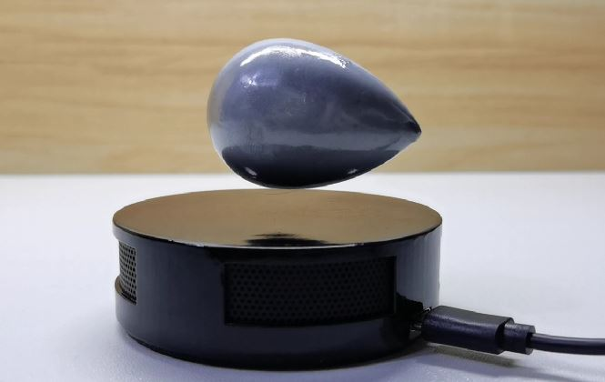
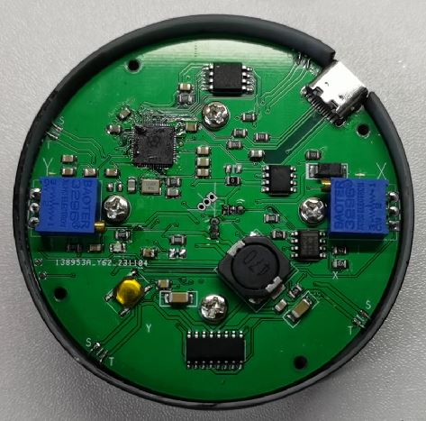

# 水滴(shuidi)

## 项目概述
### 本项目通过磁悬浮的方式实现三体水滴模型的浮空功能
### 这里会提供详细的控制程序代码，以及物料清单，方便喜欢的伙伴自行复刻。
### 本项目的控制器使用树莓派的RP2040,编程语言使用python.
### 磁悬浮采用下推式，MX1508作为线圈驱动芯片，外加三个线性输出的霍尔传感器。

## 功能介绍
### 下推式磁悬浮实现三体水滴模型的悬浮

## 细节展示

## 如果复现中遇到问题，欢迎提交issue
